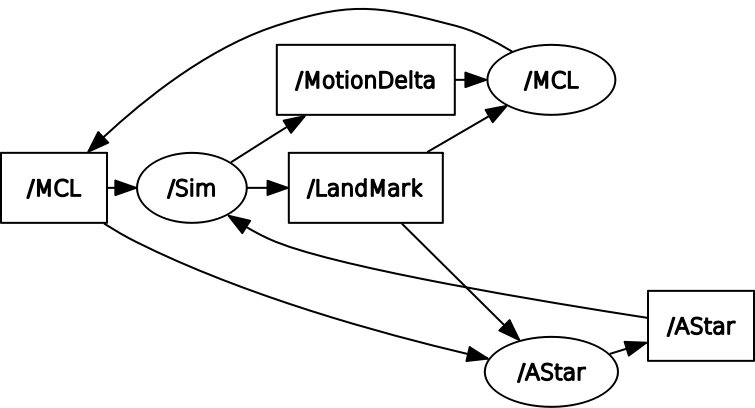
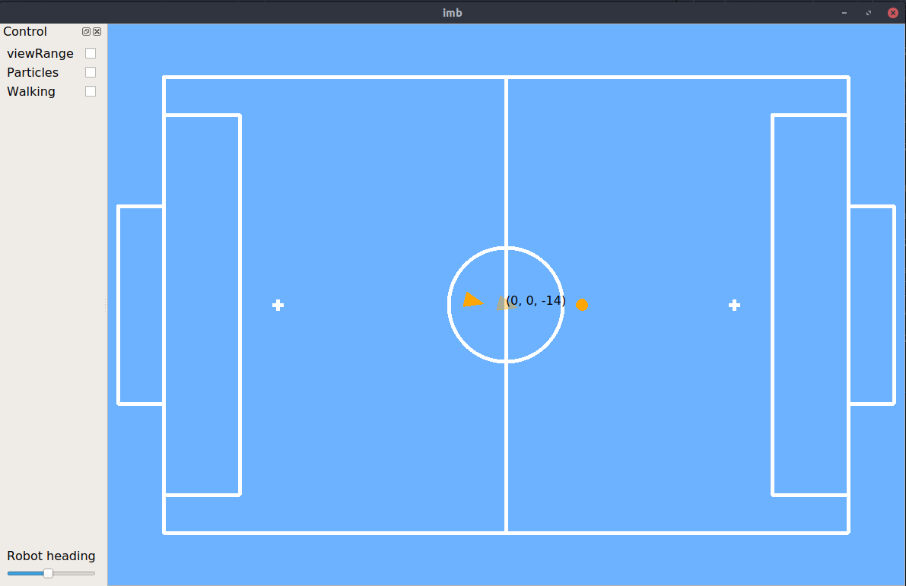
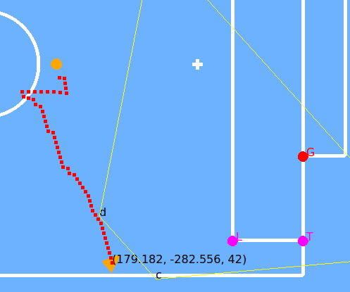
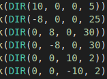
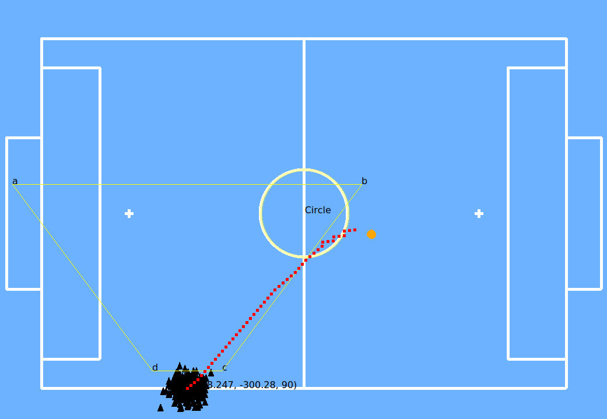

# 智能移动机器人实验报告

## 整体介绍

程序在ROS框架下实现，分为三部分：仿真器、路径规划与自定位。仿真器提供当前观测信息，自定位模块根据观测信息进行定位，路径规划模块根据定位结果与目标位置规划轨迹。

## 实现说明

### ROS框架



仿真、定位及路径规划分别为一个节点。仿真根据路径移动机器人，并根据发布观测值、目标位置及运动信息；定位据此进行定位，并发布定位结果与粒子信息（供显示）；路径规划针对定位结果与目标位置规划路径并发布。

### 仿真

仿真部分由qt实现，维护机器人真实位置、定位位置与目标位置，目标点朝向为点到右侧球门中心的向量方向。为简化任务，目标位置在任意时刻已知，机器人已知yaw角（定位与仿真朝向永远保持相同）。场景为900x600cm的简单足球场地，两边存在球门、禁区，中央有中心圆，整体界面如图：



仿真器根据机器人真实位置计算可观测到的landmark，并将其相对于机器人的位置坐标和目标位置由ros topic发布，并在画面显示当前观测到的landmark，标出其在当前定位下计算的位置，如图：



仿真可提供landmark有中心圆、T角、L角及球门柱。

若仿真器收到路径规划发布的路径，则根据路径移动仿真中机器人位置，并将该移动量发布至ros topic。

### 自定位——MCL

**Initialize:** 使用共300个粒子，初始化时在场地中随机位置进行撒点，随后每个周期对粒子进行更新。

**Resample:** 在Landmark中仅中心圆存在唯一对应，因此程序将中心圆认定为最为可靠的landmark，获得中心圆观测时，将根据中心圆相对于机器人坐标与其在场地的坐标计算机器人当前位置，随机把1/3的粒子等权重地resample到该位置并增加一定高斯噪声。此外，在一定时间未获得观测后，将随机把粒子resample至前一位置，并增加较大噪声。

**Motion: **根据仿真器返回的运动信息，并加上一定噪声对粒子位姿进行更新。

**Measurement: ** 根据观测信息，对粒子权重重新分配。对于每个粒子，根据其位姿与观测的相对位置计算观测点在场地坐标系下坐标，并根据已知场地信息，计算坐标误差，以定位估计值计算的坐标与实际坐标误差作为更新权重的依据。对于门柱、角点等不唯一的场地特征，每个观测结果计算值将与所有场地点计算坐标误差，取其最小值。更新粒子权重后对权重进行normalize

**Estimate: **使用kd-tree对粒子进行聚类，并计算每个类的权重、位姿均值、协方差等。根据统计结果判断该类是否收敛。取权重最高类作为当前定位结果，并将定位结果与粒子信息发布至ros topic。

### 路径规划——A*

程序将机器人运动简化为6种：前进、后退、向左平移、向右平移、左转及右转。机器人前进及转向较快，而左右平移与后退较慢，通过设计单位前进长度与其动作的cost使机器人尽可能少地左右平移、后退。途中即为每种运动改变的x,y,yaw值及所需cost。启发函数设计为

$$
h = abs(\Delta x_r)+abs(\Delta y_r)*3+abs(z2-z1)*6
$$

其中，$\Delta x_r$与$\Delta y_r$为目标在当前机器人坐标系下的坐标信息，$z2, z1$为目标与当前机器人朝向，尽可能令机器人旋转至目标朝向并前进移动。

每个周期将更新目标位置与定位信息，重新计算路径。每个状态维护当前位姿、cost及加上启发函数后的预估cost。

程序使用最小堆维护状态信息，比较状态的预估cost，开始向堆中push入初始状态。随后每次pop堆顶状态，根据运动方式获得下一状态位置、当前cost及预估cost，若该状态没有走出场地范围外，且目前没有遍历过更优状态，则将新位置push进堆中。若状态达到目标位置周围，结束搜索，整理路径信息并发布至ros topic。

## 运行示例

```roslaunch imb imb.launch```

[Demo Video](assets/imb_demo.mp4)

